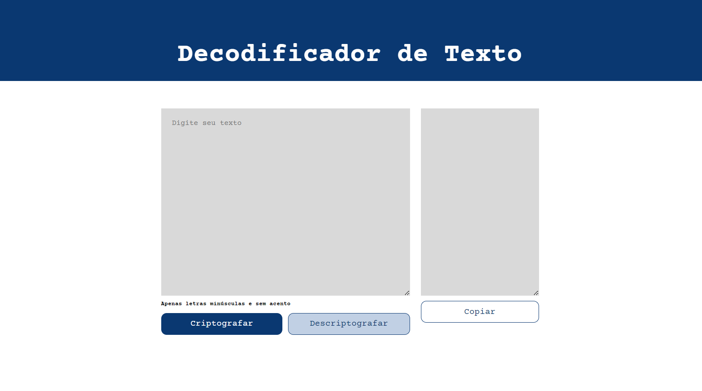

# Decodificador de Texto

Um simples decodificador de texto que permite criptografar e descriptografar mensagens.

Você pode acessar o projeto [aqui](https://jsilva-js.github.io/decodificador-de-texto/).

## Funcionalidades

- Criptografar texto: Insira o texto desejado e clique no botão "Criptografar" para criptografar o texto.
- Descriptografar texto: Insira o texto criptografado e clique no botão "Descriptografar" para descriptografar o texto.
- Copiar texto: Após criptografar ou descriptografar um texto, você pode clicar no botão "Copiar" para copiar o texto resultante para a área de transferência.

## Como usar

1. Abra o [Decodificador de Texto](https://jsilva-js.github.io/decodificador-de-texto/) no seu navegador.
2. Digite o texto que deseja criptografar no campo "Digite seu texto".
3. Clique no botão "Criptografar" para criptografar o texto.
4. O texto criptografado será exibido no campo "Texto Decodificado".
5. Para descriptografar o texto, copie o texto criptografado e cole-o no campo "Texto Decodificado".
6. Clique no botão "Descriptografar" para descriptografar o texto.
7. O texto descriptografado será exibido no campo "Digite seu texto".

## Tecnologias Utilizadas

- HTML
- CSS
- JavaScript

## Contribuição

Contribuições são bem-vindas! Sinta-se à vontade para abrir uma issue se encontrar algum problema ou enviar um pull request com melhorias.

## Captura de Tela

## Autor

Desenvolvido por [Jefferson Silva](https://github.com/jsilva-js).

---
